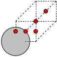
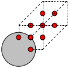
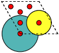
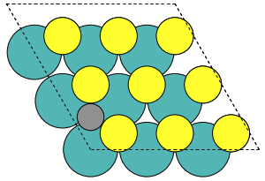
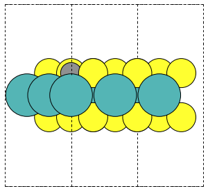
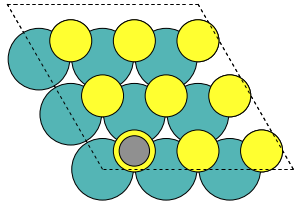
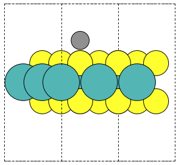

========================
Setting up point defects
========================

.. currentmodule:: ase.build

The DefectBuilder
=================

The DefectBuilder :class: incorporates tools to set up single
point defects in supercells. Currently, it includes the creation of
vacancy, substitutional defects, interstitial defects and adsorption
sites.

Example - Vacancies, subst. defects, interstitials
--------------------------------------------------

First set up a bulk Ag structure::

  from ase.build import bulk
  atoms = bulk('Ag')

Using the Ag bulk structure, we can now initialize the DefectBuilder::

  from ase.build.defects import DefectBuilder
  builder = DefectBuilder(atoms)

and afterwards, we can easily create the vacancies via::

  vacancies = builder.get_vacancy_structures()

Since there is only one unique vacancy in bulk Ag, it will
return a list with only one Atoms object of the vacancy structure in
a supercell. In general, for more complex structures it will return
a list of all vacancy defects. By default, the defect will be set
up in a 3x3x3 supercell (3x3x1 for 2D structures), but the user can
specify the number of repititions, i.e. define N in NxNxN with passing
``sc=N`` to the ``get_vacancy_structures()`` method. Furthermore,
one can also define a physical size of the supercell in Angstrom with
the ``size`` argument and the method will automatically set up a
suitable integer repitition of the input structure.

Similarly, one can generate substitutional defects via::

  substitutions = builder.get_substitution_structures(extrinsic=['C', 'O'])

By default, it will set up intrinsic subst. defects (set ``intrinsic=False``
if this is not desired), and the user can pass a list of extrinsic elements
which will be used to create the defect structures. For this particular example,
``substitutions`` will contain two defects (C:sub:`Ag`, and O:sub:`Ag`).
Defining the supercell works in the same way as for the vacancy case.

Lastly, interstitial defects with elements of ``kindlist`` can be created
in the following way::

  interstitials = builder.get_interstitial_structures(kindlist=['C', 'O'])

which returns a list of interstitial defects. Note, that the number of
interstitials can be controlled by the ``min_dist`` parameter (minimum
distance between interstitial sites) that is 1 Angstrom
by default and can be defined when initializing the :class: `DefectBuilder`.
In addition, by setting ``Nsites`` in ``get_interstitial_structures()`` one can
define the exact number of interstitials that will be created. The respective
sites will be chosen based on the largest distance to atoms of the pristine
structure. Note, that this interstitial site creation can create a lot of
structures in one go. It might be useful to look at the general interstitial
sites before actually creating the structures. This is done by::

  unique, equivalent = builder.create_interstitials()

returning two mock structures incorporating all possible unique, and equivalent
(by symmetry) interstitial structures in the primitive unit cell. For the case of
Ag, the unique and equivalent interstitial positions can be viewed with the ASE
GUI and look like this:

 * unique interstitials: |unique|
 * equivalent interstitials: |equivalent|

Example - Adsorption sites
--------------------------

Let us know set up adsorption sites on a 2D material, e.g. MoS2. Therefore, we
need to set up MoS:sub:`2` first and initialize the :class: `DefectBuilder`
just like in the previous example::

  from ase.build import mx2
  from ase.build.defects import DefectBuilder
  mos2 = mx2('MoS2', vacuum=5)
  builder = DefectBuilder(mos2, min_dist=0.5)

Note, that we reduced the ``min_dist`` parameter such that we don't miss any
adsorption sites that are close to each other. Next, we want to get an overview
what kind of adsorption sites are present with the given setup::

  from ase.visualize import view
  adsorption_sites = builder.create_adsorption_sites()
  view(adsorption_sites)

|adsorption_sites|

Once we confirmed that the setup is sane we can actually create the adsorbate
structures (in a 3x3x1 supercell by default) for a list of elements. Here,
we just want to dope the material with carbon atoms::

  adsorption_structures = builder.get_adsorbate_structures(kindlist=['C'])

The method will return a list of structures where each adsorption site from
before is occupied with an element of ``kindlist`` (only carbon here).
The method automatically adjusts the distance from the top of the layer by
calculating the sum of covalent radius of closest lying pristine atom and the
adsorbate. That means, that for different positions on the layer and for different
dopants, the z-coordinate of the adsorbate varies. Let us for example look at the
top and hollow site (i.e. element 0 and 5 in ``adsorption_structures``)::

  view(adsorption_structures[0]) # top adsorption site
  view(adsorption_structures[5]) # hollow adsorption site

and we get:

  * hollow site: |hollow_top| |hollow_side|
  * top site: |top_top| |top_side|

Other
-----
More specifics can be found in the sourcecode and respective docstrings.

